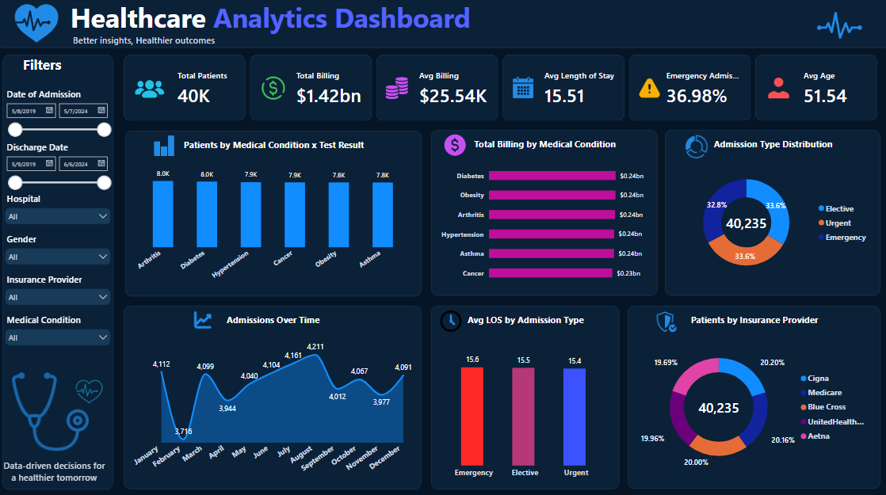

# 🏥 Healthcare Analytics Dashboard

A comprehensive Power BI business intelligence solution designed to monitor hospital operations, patient demographics, medical conditions, billing metrics, and resource utilization[cite: 6].

---

## 📊 Project Overview
This project transforms healthcare data into actionable insights, helping hospital administrators track patient length of stay (LOS), billing distributions across medical conditions, and emergency vs. elective admission ratios[cite: 6].

---

## 🚀 Key Features & KPIs
* **Total Patients Tracked:** ~40K patients across multiple medical categories[cite: 6].
* **Financial Overview:** Total billing tracking ($1.42bn) with breakdown by medical conditions and insurance providers[cite: 6].
* **Operational Metrics:** Average length of stay (LOS), emergency admission percentages, and patient age demographics[cite: 6].
* **Interactive Filtering:** Date range slicers, hospital location filters, gender demographics, and insurance provider breakdowns[cite: 6].

---

## 📈 Dashboard Preview

---

## 🛠️ Tools & Technologies
* **Tool:** Microsoft Power BI
* **Data Prep:** Power Query, DAX for calculated measures (Avg Billing, Length of Stay).
* **UI Design:** Professional dark mode interface optimized for executive medical reporting.

---

## 💡 Key Insights
* **Admission Distribution:** Evenly split distribution across elective, urgent, and emergency admission types[cite: 6].
* **Billing Patterns:** Chronic conditions such as Diabetes, Obesity, and Arthritis account for the highest aggregate billing percentages[cite: 6].
